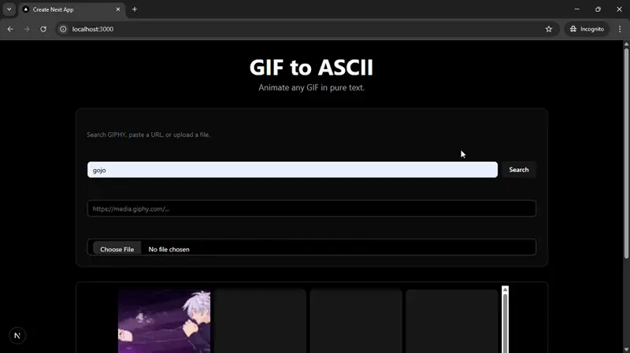

# GIF & WebP to ASCII Art Converter

A full-stack web application that converts any animated GIF or WebP file into animated ASCII art, right in your browser. Search for GIFs using the GIPHY API, paste a direct URL, or upload your own file to see it rendered in pure text.



---

## About The Project

This project was built to explore full-stack development by creating a fun, interactive, and visually engaging tool. The application consists of a Python backend that handles all the heavy lifting of image processing and a modern, responsive Next.js frontend for the user interface.

The core challenge was to efficiently process each frame of an animated image (supporting both GIF and the modern WebP format), convert it to a high-quality ASCII representation, and stream the result to the frontend for smooth animation.

---

## Tech Stack

This project is a demonstration of a multi-language, full-stack application.

**Frontend:**
* **Framework:** Next.js
* **Language:** TypeScript
* **Styling:** Tailwind CSS
* **UI Components:** shadcn/ui
* **Icons:** Lucide React

**Backend:**
* **Framework:** FastAPI
* **Language:** Python
* **Image Processing:** Pillow
* **API Communication:** Requests

---

## Features

* **GIPHY Integration:** Search for GIFs directly within the app using the GIPHY API.
* **URL Conversion:** Paste a direct URL to any GIF or WebP file.
* **File Upload:** Upload your own animated files from your computer.
* **Real-time Animation:** The converted ASCII art is animated in the browser to match the original's frame rate.
* **High-Quality Conversion:** Uses a detailed character set and image processing to create precise ASCII art.
* **WebP Support:** Correctly processes and converts both GIF and modern WebP formats.

---

## Getting Started

To get a local copy up and running, follow these simple steps.

### Prerequisites

* Python 3.8+
* Node.js and npm
* A GIPHY API Key

### Installation & Setup

1.  **Clone the repo:**
    ```sh
    git clone [https://github.com/your_username/your_project_name.git](https://github.com/your_username/your_project_name.git)
    ```

2.  **Setup the Backend:**
    ```sh
    # Navigate to the backend directory
    cd gif-converter-backend

    # Create and activate a virtual environment
    python3 -m venv venv
    source venv/bin/activate

    # Create a .env file for your secret key
    touch .env
    ```
    Open the `.env` file and add your GIPHY API key:
    ```
    GIPHY_API_KEY="your_api_key_here"
    ```
    Install the required packages and run the server:
    ```sh
    pip install -r requirements.txt
    uvicorn main:app --reload
    ```
    The backend will be running at `http://127.0.0.1:8000`.

3.  **Setup the Frontend:**
    Open a **new terminal window**.
    ```sh
    # Navigate to the frontend directory
    cd gif-converter-frontend

    # Install shadcn/ui and other dependencies
    npm install

    # Run the development server
    npm run dev
    ```
    The frontend will be running at `http://localhost:3000`.

4.  **Open your browser** to `http://localhost:3000` and start converting!

---
## API Endpoints

The Python backend provides the following API endpoints:

| Method | Endpoint                    | Description                                       |
| :----- | :-------------------------- | :------------------------------------------------ |
| `GET`  | `/api/search-giphy`         | Searches GIPHY for GIFs based on a query.         |
| `POST` | `/api/convert-from-url`     | Converts an image from a provided URL.            |
| `POST` | `/api/convert-from-upload`  | Converts an uploaded image file.                  |
